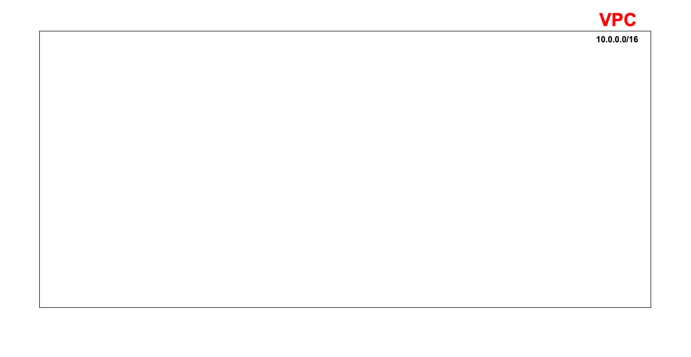

# Create a VPC (AWS)
## Overview
A **Virtual Private Cloud (VPC)** is an isolated network within the AWS Cloud, where you can launch AWS resources such as EC2 instances.

> It is conceptually similar to an **Azure Virtual Network (VNet)**

## Steps to Create a VPC
1. In the **AWS Management Console**, navigate to **VPC**.
2. Click **Create VPC**.
3. Select **VPC only** (this allows for more manual and granular configuration).

### VPC Configuration
#### 1. Name and Tags
 * Enter a *Name tag* for the VPC.
 * Naming conventions are important to clearly identify the usage/purpose and environment of the resource.
> Nb. 
<br> A name is just a **tag**, which is a key-value pair (i.e. Name: se-dare-first-2tier-vpc).
<br> 
<br> Tags are used extensively for organisation, cost allocation, automation and monitoring.

#### 2. IP Addressing
* Select **IPv4 CIDR block - Manual input**
* Enter:
    ```
    10.0.0.0/16
    ```
> Nb. 
<br> The VPA CIDR block is typically the largest network range in your architecture.
<br> 
<br> You should balance:
<br> * Efficiency (allocating more IPs than necessary)
<br> * Future growth (enough IPs for subnets)


#### 3. IPv6
* Select ***No IPv6 CIDR block**

#### 4. Tenancy
* Leave Tenancy set to **Default**
<br> Tenancy options:
    * Default - Resources run on shred hardware (most common and cost-effective).
    * Dedicated - Resources run on hardware dedicated to your AWS account (higher cost, used for compliance)

#### 5. VPC Encryption Control
* Configure **VPC encryption control** if required, or else select **None**.
* This enforces encryption for supported traffic accorss the VPC and stregthens security.
> Nb.
<br> This does not automatically encrypt all services, it enforces encryption policies where possible.

#### 6. Additional Tags
* Add any additional **tags** for:
  * Monitoring
  * Cost allocation
  * Inter-service identification
  * Automation

#### 7. Create the VPC
* Review the configuration.
* Click **Create VPC**


