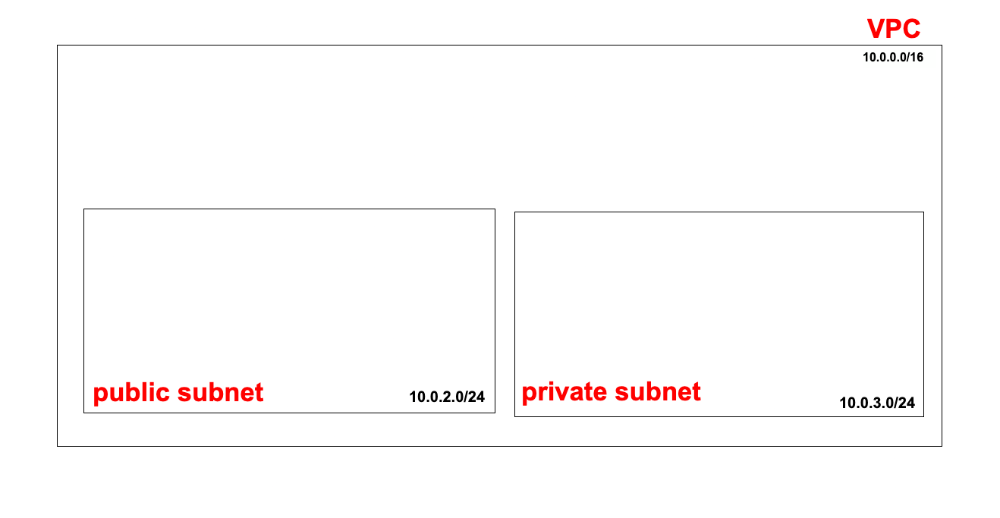

# Create a Subnet
## Overview
A **subnet** is a smaller network segment within a VPC.
<br> Subnets allow you to organise resources by **availability zone**, **access level** (public/private), and **workload type**.

## Steps to Create Subnets
1. 1. In the **AWS Management Console**, navigate to **Subnets**.
2. Click **Create subnets**.
3. Select **VPC ID** of the VPC previously created.
> Nb.
<br> Subnets must exist within a VPC and use IP ranges that fall instde the VPC CIDR block.

### Subnet 1 - Public Subnet
#### 1. Subnet Details
* **Subnet name**: `se-dare-public-subnet`
* **Availability Zone**: eu-west-1a
> Nb.
<br> * AWS allows any subnet name, but following a clear naming convention makes resources easiers to identify and manage.
<br> * To connect to multiple AZ, one will need to create multiple subnets for each zone.

#### 2. IP Addressing
* **VPC IPv4 CIDR block**: `10.0.0.0/16` (pre-selected)
* **Subnet IPv4 CIDR block**:
    ```
    10.0.2.0/24
    ```
> Nb.
<br> A /24 subnet provides 256 IP addresses (251 usable by AWS resources). So 10.0.2.[0-256] IP addresses permitted.

### Subnet 2 - Private Subnet
  4. Click **Add new subnet**

#### 1. Subnet Details
* **Subnet name**: `se-dare-private-subnet`
* **Availability Zone**: eu-west-1b (different from public subnet)

> Nb.
<br> Availability Zones are physically separate data centres within a region. They are located close to each other but are isolated to improve:
> * Fault tolerance
> * High availability
>  * Disaster recovery
>  <br> 
> <br> Resources are not automatic replicas; redundancy must be designed explicitly.

#### 2. IP Addressing
* **VPC IPv4 CIDR block***: `110.0.0.0/16`
* **Subnet IPv4 CIDR block**:
    ```
    10.0.3.0/24
    ```
> Nb.
<br> A /24 subnet provides 256 IP addresses (251 usable by AWS resources). So 10.0.3.[0-256] IP addresses permitted.


