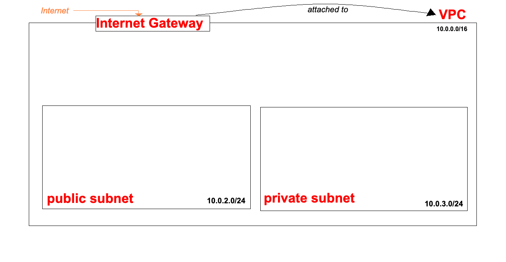

# Create an Internet Gateway
## Overview
An **Internet Gateway (IGW)** enables communication between resources in a VPC and a public internet. It provides a target in route tables for **internet-routable traffic**.

## Steps to Create an Internet Gateway
1. In the **AWS Management Console**, navigate to **Internet Gateways**.
2. Click **Create internet gateway**.
3. Enter a *Name tag*:
    ```
    se-dare-first-2tier-vpc-igw
    ```

## Attach the Internet Gateway to a VPC
4. After creation, the Internet Gateway will be in an *unattached state*.
> Nb.
<br> AWS configures the Internet Gateway automatically in the background, but it must be explicitly attached to a VPC before it can be used.
5. Select the Internet Gateway.
6. Choose **Actions -> Attached to VPC**.
7. Select the target VPC from **Available VPCs**.
8. Click **Attach internet gateway**. 



