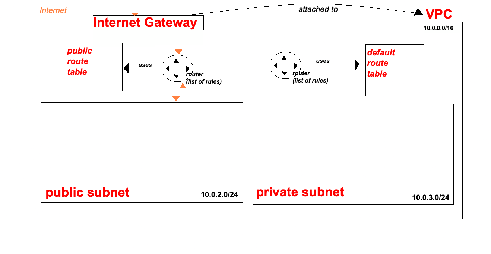

# Create a Route Table (Public)
## Overview
A **route table** defines how network traffic is irected within a VPC.
By associating a route table with a subnet, you control where traffic from that subnet can flow.

A **public route table** includes a route to an internet gateway, allowing outbound internet access (orange flow in VPC Architecture).

## Steps to Create a Route Table
1. In the **AWS Management Console**, navigate to **Route tables**.
2. Click **Create route table**.
3. Enter a *Name tag*:
    ```
    se-dare-first-2tier-vpc-public-rt
    ```
4. Select the **VPC**:
    ```
    se-dare-first-2tier-vpc
    ```
5. Click **Create route table**.


## Associate Route Table with a Subnet
6. Open the **Subnet associations** tab.
7. Under **Explicit subnet associations**, click **Edit subnet associations**.
8. Select the **public subnet**.
9. Select **save ssociation**.
> Nb.
> <br> Subnets are private by defaults.
> <br> A subnet becomes *public* only when it is associated with a route table that has a route to an internet gateway.

## Configure Routes
10. Select the *Routes* tab.
11. Click **Edit routes**.
12. Select **Add routes**.
13. For **Destination**, enter:
    ```
    0.0.0.0/0 # wildcard - matches all IPv4 traffic
    ```
14. For **Target**, select:
    * **Internet gateway**
    * `se-dare-first-2tier-vpc-igw`
15. Click **Save changes**.

## Verification
16. Confirm the new route appears in the **Routes** tab of the route table.


