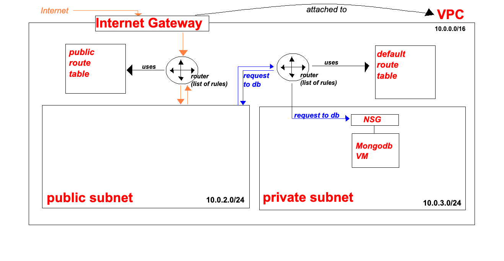
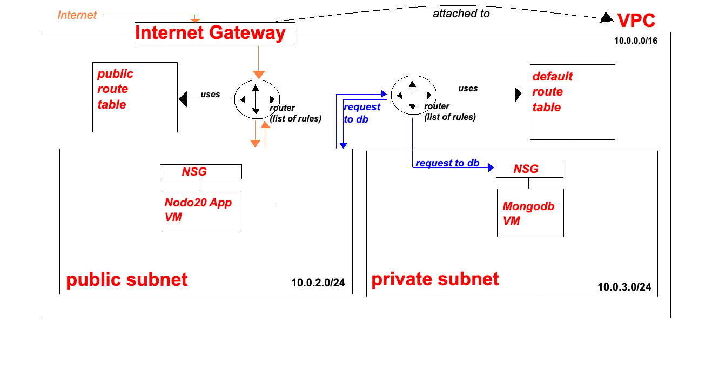

# Create Database Instance (MongoDB)
## Overview
The database is created first so that the application can be tested against a known, reachable backend. This instance will run MongoDB inside the **private subnet**, with no public internet access.

## Launch the Database EC2 Instance
1. In the **AWS Management Console**, navigate to **EC2**.
2. Click **Instances**.
3. Select **Launch instance**.
4. Enter an Instance name (ie. `se-dare-mongodb`)
5. Select an existing AMI with MongoDB installed.
6. Choose instance type: `t3.micro`
7. Select an existing **key-pair**.

## Network and Security Configuration
8. Under **Network settings**, click **Edit**:
   *  **VPC**: select the previously created VPC.
   *  **Subnet**: selet the **private subnet** previously created.
   *  **Auto-assign public IP**: Disabled
  
### Security Group (Database)
* Create a new **security group**:
   *  **Name**: `se-dare-private-subnet-mongo-db-sg`
   *  **Description**: Allow access to MongoDB subnet from application subnet.
* Leave the default **Inbound Security Group rule 1**.
* Add an inbound rule:
  * **Type**: Custom TCP
  * **Port**: 27017
  * **Source**: `10.0.2.0/24` (application subnet CIDR)
> Nb.
>   Databases do not need public internet access. Restricting access to a specific CIDR block ensures only resources in teh application subnet can connect.

### Port Selection (Reason for importance)
* MongoDB uses **27017** by default.
* Databases can run on non-default ports:
  * Avoid port conflicts
  * Add a layer of security through obsecurity (hackers trying default)
* Placing the database in a private subnet is the primart security control; port customisation is a secondary measure.

9. Click **Luanch instance**.
10. After launch, verify:
    * The instancse has a **private IPv4 address only**
    * No public IPv4 address is assigned.
> Nb.
>   Private IPs are unique **within the VPC**, and are not reachable from the internet.

> Nb.
>   
Add the CIDR block (10.0.2.0/24) to ensure that the app subnet can access it. If we had creatednan add securtiyt group, we could use that as the source. CIDR block is the most secure. if there are three public subnets, using a security group is easier configuration. so depends on use. 
if multiple apps in the public subnets, but they have different security groups, then securtiy group can be used to distinguish access permissions.
think about autoscaling groups. (didn't get this)

# Create Application Instance
## Overview
The application instance is deployed in a **public subnet**, allowing inbound traffic from the internet while maintaining controlled access to the private database.

## Launch the Application EC2 Instance
1. In the **AWS Management Console**, navigate to **EC2**.
2. Click **Instances**.
3. Select **Launch instance**.
4. Enter an Instance name (ie. `se-dare-node20-app`)
5. Select an existing AMI with node20 installed.
6. Choose instance type: `t3.micro`
7. Select an existing **key-pair**.

## Network and Security Configuration
8. Under **Network settings**, click **Edit**:
   *  **VPC**: select the previously created VPC.
   *  **Subnet**: selet the **public subnet** previously created.
   *  **Auto-assign public IP**: Enabled

### Security Group (Database)
* Create a new **security group**:
   *  **Name**: `se-dare-public-subnet-app-sg`
   *  **Description**: Allow internet and application traffic.
* Leave the default **Inbound Security Group rule 1**.
* Add a first inbound rule:
  * **Type**: HTTP
  * **Port**: 80 (default)
  * **Source**: `10.0.0.0/0`
* Add a second inbound rule:
  * **Type**: TCP
  * **Port**: 3000
  * **Source**: `10.0.0.0/0`

---
9. Click **Luanch instance**.
10. After launch, verify:
    * The instance has **private and public** IPv4 addresses

### DNS and Connectivity Notes
* Within a VPC, instances communicate using **private IP addresses**.
* AWS also provides an *internal DNS resolution** for instances in the same VPC.
* Custom DNS namees can be layered on later (eg. Route 53), but are not required for internal communication.

