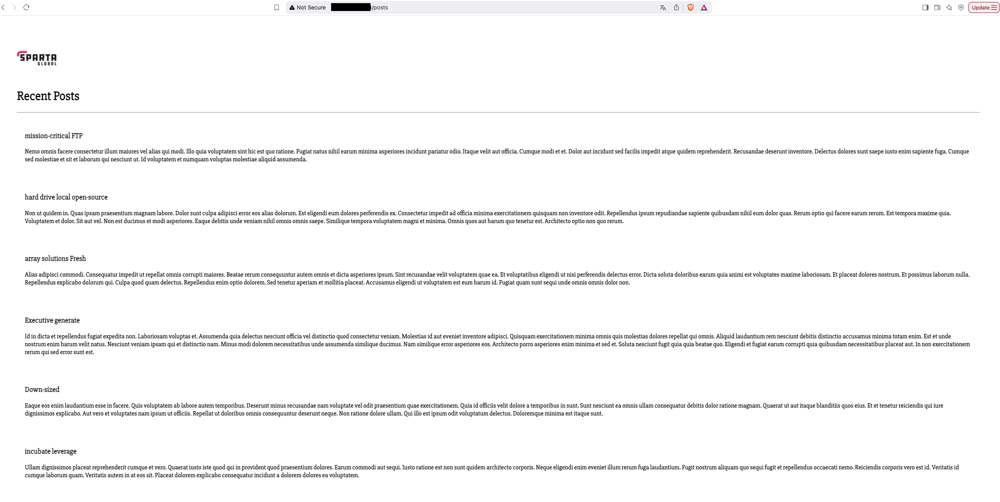
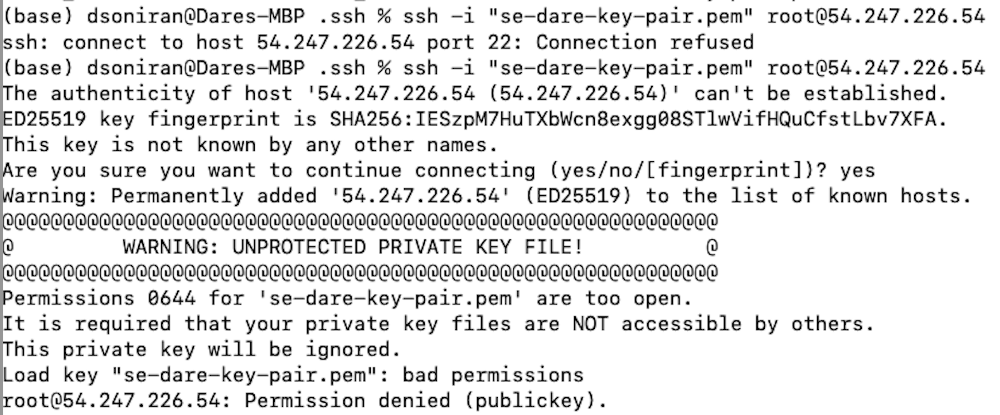
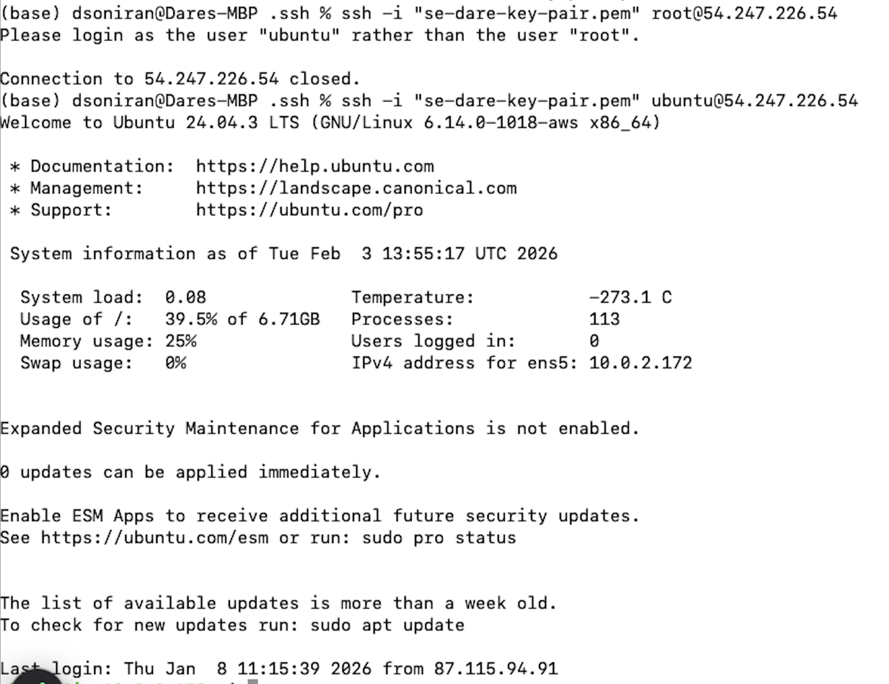

# Deploy Application
1. Connect to the app
    ```
    ssh -i "se-dare-key-pair.pem" root@54.247.226.54
    ```
2. Check files and directory.
    ```
    ls
    ```
3. Enter the directory with the application script
    ```
    cd nodejs2-sparta-test-app-2025/app
    ```
4. Install npm
    ```
    sudo npm install --yes
    ```
5. Confirm package manager installed
    ```
    pm2 --version
    ```
6. Kill any active operations
    ```
    pm2 kill
    ```
7. Start app
    ```
    pm2 start app.js
    ```
8. Using the public IPv4 address, check that the app is running (ensure on http and not https)


1.  Export database private IPv4 address
    ```
    export DB_HOST=mongodb://<DB-ID-ADDRESS>:27017/posts
    ```
2.  Confirm correctly exported
    ```
    echo $DB_HOST
    ```
3.  Kill any active operations
    ```
    pm2 kill
    ```
4.  Seed the seed
    ```
    node seeds/seed.js
    ```
5.  Start app
    ```
    pm2 start app.js
    ```


# Issues Raised
## ssh-key permissions




## Root username

