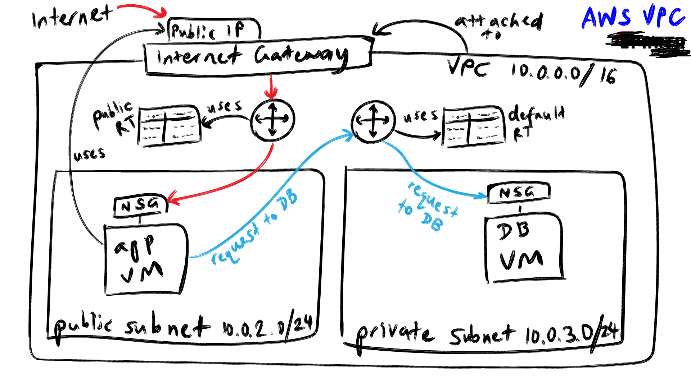

# Introduction to Virtual Private Cloud (VPC)

## What is a VPC?
A **Virtual Private Cloud (VPC)** is a logically isolated network within a cloud provider where you control:

* IP address ranges
* Subnets
* Routing
* Traffic flow between resources

A VPC in AWS is conceptually similar to an **Azure Virtual Network (VNet)**.

## Core Concept: Traffic Control
A VPC is all about **traffic**:
* where traffic is allowed to go;
* what it can connect to;
* what is explicitly blocked

Every network decision in a VPC ultimately affects **how traffic is routed and secured**.

## Private IPv4 Addressing
Resources inside a VPC typically use **private IPv4 addresses**, which are:
* not routable over the public internet
* Only reachable within the VPC (or connected networks)
These addresses are allocated from a defined IP range called a **CIDR block**.

## CIDR Blocks (Classless Inter-Domain Routing)
A **CIDR block** defines the range of IP addresses available within a VPC or subnet.
    ```
    IP address / prefix length
    ```

For example: `10.0.0.0/24` means that the first **25 bits** are fixed, and the remaining bits are availabe for host addresses.


# Subnet Masks and Prefix Lengths / Octets and IP Ranges
* Each IPv4 address has 4 octets.
* Each octet ranges from 0-255.
* CIDR prfix lengths are often in **multiples of 8**, because they align with full octets.
* Valid IPv4 CIDR ranges are `/0` to `/32`.
* Subnets do not need to slign to muplies of 8 (eg. `/20`, `/22`, `/26` are all valid)
> NB. The more bits you reserve for the network, the fewer IPs remain for hosts.
> <br> Understanding binary subnetting helps, but AWS abstracts most of this complexity.

## How to choose a CIDR Size
Your CIDR choice depends on: 
* How large you want your VPC to be
* How many subnets you need
* Expected growth
* Network isolation requirements
Tip: Allocate a larger CIDR for the VPC, then use smaller CIDRs for subnets.

|**Prefix**|**Common Use**|
|-|-|
|`/8`|Very large networks|
|`/16`|Typical VPC size|
|`/24`|Common subnet size|

* Valid IPv4 CIDR ranges are `/0` to `/32`.
* Subnets do not need to slign to muplies of 8 (eg. `/20`, `/22`, `/26` are all valid)

## Example: `10.0..0.0/16`
* The first to octets or **16 bits** (`10.0`) are fixed.
* The remaining octets can vary:
  * `10.0.0.0` -> `10.0.255.255`

This provides:
* 65,536 total IP addresses
* Suitable for a large VPC with multiple subnets
> Nb. Any resource must fall within this CIDR range to be reachable inside the VPC.

# Route Tables
Every VPC contains **route taables** that determine where traffic goes.

## Default Route Table
* Automatically created with the VPC
* Allows internal traffic within the VPC CIDR (i.e. 10.0.0.0/16 -> local)
* This route cannot be removed.

# Why are Security Groups Still Required?
Because the default route table allows all internal traffic:
* Any resource in the VPC can reach any other resource at the network layer.

To enforce access control (eg. protect a database):
* Security Groups must be used
* They define what IPv4 is allowed to talk to what IPv4, even when routing allows it.
* For example, even though routing allows 10.0.0.0/16 traffic, a database NSG can restrict access to only the application tier.
* Preference for creating a security group for the subnet CIDR or NSG is dependent on the architectural requirements.


## Review Instructions in `create-vpc` folder
1. Create a VPC
2. Create a public and private subnet
3. Create an Internet Gateway and assign to VPC
4. Create and configure a custom public route table
5. Create EC2 instances for Database and App
6. Deploy Application




# Benefits of VPCs

* **Network isolation**: Resources run in a logically isolated network, separated from other customers.

* **Full control over IP addressing**: Define your own IPv4/IPv6 CIDR blocks, subnets, and address allocation.

* **Granular traffic control**: Control traffic flow using route tables, security groups, and network ACLs.

* **Improved security posture**
  * Private subnets for sensitive resources (e.g. databases)
  * No public internet exposure unless explicitly configured

* **Scalable network design**:
  * Multiple subnets
  * Multiple Availability Zones
  * Auto Scaling–friendly architectures

* **High availability and fault tolerance**: Design across Availability Zones to reduce single points of failure.

* **Hybrid connectivity**: Securely connect on-premises networks using:
  * VPN
  * Direct Connect

* **Fine-grained access control**: Security Groups enable least-privilege, resource-based access rules.

* **Support for private communication**: Resources communicate using private IPs and internal DNS.

* **Flexible routing option** to enable or restrict access to:
  * Internet Gateways
  * NAT Gateways
  * VPC peering
  * Transit Gateways

* **Cost control and visibility**: Tagging and network segmentation improve cost allocation and monitoring.

* **Compliance and governance support**: Helps meet regulatory and compliance requirements through isolation and control.